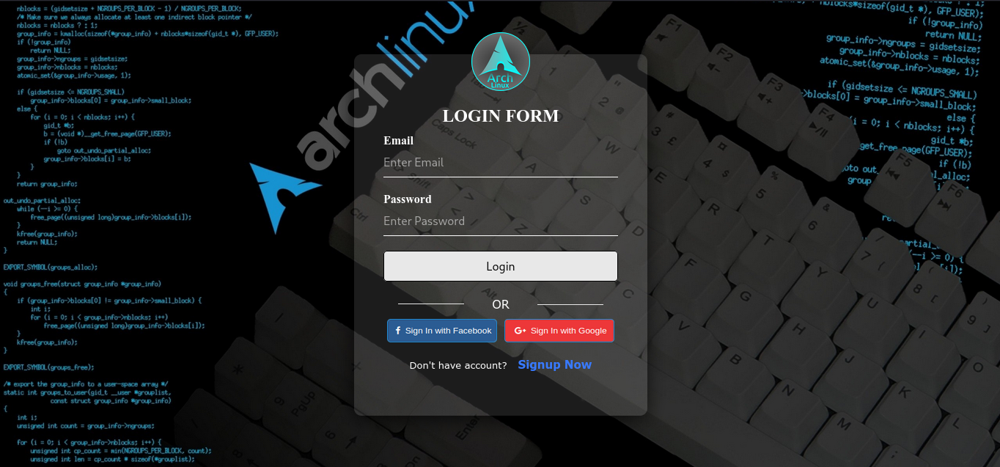

# React Login

_Login page build with react.js_ whit node v16




If the user is logged, the user will can't to access to login page. On the other hand, if the user has not logged in, he will not be able to access the main menu. To simplify the project, a file (fake api in /public/fake_api.json) was created which contains two users and their encrypted passwords (andres and lucelly, respectively).

## Starting

This app only needs [node](https://nodejs.org/es/) v16 to be deployed locally.

_Open one terminal and execute:_

```
1. git clone https://github.com/andres613/login-react.git
2. cd login-react/
3. npm install && npm start
```
If want deploy it in a development environment, execute 1 and 2 steps an then run
```
docker-compose up
```

Then, open a web explorer and tipe **http://localhost:3000/** in direcction bar to preview the project

## Built whit

* [React](https://reactjs.org/) - A JavaScript library for building user interfaces.
* [React Router](https://reactrouter.com/web/guides/quick-start) - With this library, you get dynamic routing to render a component.
* [md5](https://www.npmjs.com/package/md5) - A JavaScript function for hashing messages with MD5.
* [universal-cookie](https://www.npmjs.com/package/universal-cookie) - A node package allows you to store and get cookies.

__________________________
__________________________

## Autor

* **Andrés E. Restrepo F.** - *This project* - [login-react](https://github.com/andres613/login-react)
